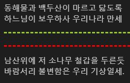

# 문자 콘텐츠

### **ol,** **ul** **{** **display: block; }**

###  **li** **{** **display: list-item; } 블록요소라고 볼 수 있다\(부모요소가 블록이기떄문에\)**

&lt;li&gt; :각 항목

&lt;ol&gt;:정렬된 목록 ordered list 순서가 있는 목록\(ex.과일들\)

&lt;ul&gt;:정렬되지 않은 목록 unordered list 순서가 없는 목록

 \*&lt;li&gt;는 단독으로 사용될 수 없고, ol,ul 이부모가 되야함\*

```markup
<ol type=i reversed start="23">  /*ol태그 속성:  type=항목에 매겨지는 번호의 유형 / reserved= 역순으로 / start= 부터 시작)*/

        <li value="23">                 

            apple

            <ol>

                <li>apple</li>                    (li태그 속성: value=항목의 순서를 설정)

                <li>apple2</li>

                <li>apple3</li>

            </ol>

        </li>

        <li value="2">apple2</li>

        <li>apple3</li>

  </ol>
```

&lt;ol&gt;보다는 &lt;ul&gt;의 사용빈도가 더 크다


### **&lt;dl&gt;**,&lt;dt&gt;,&lt;dd&gt;**{** **display: block; }**

apple- 무엇무엇이다. 여기서      apple:용어&lt;dt&gt;

                                                        ****무엇무엇이다.:정의&lt;dd&gt;

                                                        두가지를 묶어서 &lt;dl&gt;


\*&lt;dl&gt;태그는 &lt;dt&gt;,&lt;dd&gt;태그만을 포함하고 있어야 한다. \*

 - css먹이기가 상당히 까다롭다. 그래서 &lt;ul&gt;,&lt;li&gt;태그로 대체해서 많이 사용.

```markup
 <dl>

        <dt>Coffee</dt>

        <dd>Coffee is a brewed drink.</dd>

        <dt>Milk</dt>

        <dd>Milk is a nutrient-rich.</dd>

    </dl>
```

이런 형태를 가지고 있는데, &lt;ul&gt;,&lt;li&gt;로 바꿔보자

```markup
 <ul>

        <li>

            <dfn>Coffee</dfn>

            <p>Coffee is a brewed drink.</p>

        </li>

        <li>

            <dfn>Milk</dfn>

            <p>Milk is a nutrient-rich.</p>

        </li>

    </ul>
```

### **&lt;p&gt;{** **display: block; }**

하나의 문단을 설정할때 \(일반적인 문장 / 문단\)

​\*정보통신보조기기등은 다음문단으로 넘어갈 수 있는 단축키 제공.\*

​

### **&lt;/hr&gt;** **{** **display: block; }**

문단의 분리 \(Horizental Rule\)

​ \*대부분 수평선\(border\)로 표시되지만 그 표시를 목적으로 쓰면 안된다.\*

 - 문단의 분리를 목적으로 사용하다보니 수평선이 들어가는 것이다.\(수평선은 수정가능\)

```markup
 <p>

     동해물과 백두산이 마르고 닳도록<br/>

     하느님이 보우하사 우리나라 만세

 </p>
 <hr>
 <p>

     남산위에 저 소나무 철갑을 두른듯<br/>

     바람서리 불변함은 우리 기상일세.

 </p>

//css

hr{

    padding:10px;

    border:none;

    border-top: 2px dashed yellowgreen;

    border-bottom:2px dashed red;

}
```



### **&lt;pre&gt;** **{** **display: block; }**

서식이 미리 지정된 텍스트를 설정한다. \(preformatted text\)

 - &lt;br&gt;태그와 같은 줄바꿈 없이도 사용자가 입력한 서식 그대로 표시가능

 - 기본적으로 Monospace 글꼴 계열로 표시된다. \(각자 글씨대로의 넓이가 같다 &gt; 가독성 확보\)

```markup
<pre>동해    물과 백두산이 마르고 닭도록

하나님이 보우하사 우리나라 만만세</pre>
```


_서식 그대로 보여지기 때문에 태그&lt;&gt;와 문장의 빈공간 없도록 만들어야 한다_

### \*\*\*\*

### **&lt;blockquote&gt;** **{** **display: block; }**

일반적인 인용문을 설정한다.

​속성: cite

```markup
<blockquote cite="https://www.huxley.net/bnw/four.html">

<p>Words can be like X-rays, if you use them properly—they’ll go through anything.</p>

<footer>—Aldous Huxley, <cite>Brave New World</cite></footer>

</blockquote>
```


